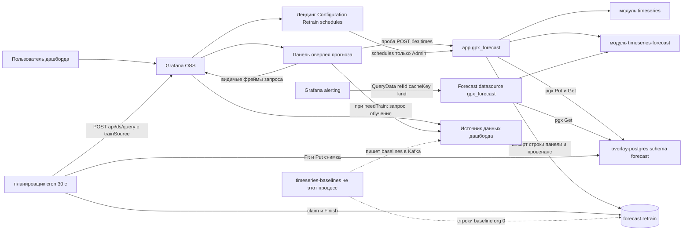

# 1. Контекст системы

Кто общается с плагином и что он не должен хостить. Страниц три: лендинг — только текст, Configuration хранит DSN снимка и `/forecast` не вызывает, Retrain schedules показывает и правит строки расписаний. Видимый запрос панели идёт всегда. Второй запрос источника (обучение) — только при `needTrain` или Retrain.

Grafana alerting ходит не в панель, а во вложенный источник **Forecast** (`QueryData`): он только `Restore` + `ForecastRange` по `cacheKey`, никогда не обучает. Оба процесса `gpx_forecast` (app и datasource) читают одну таблицу снимков в Postgres.

Третий участник — автономный пересчёт по cron внутри процесса app (`FORECAST_RETRAIN_CRON`, тик 30 с): он берёт **свои** строки `forecast.retrain` (`scope=panel`, своя org) через `FOR UPDATE SKIP LOCKED`, тянет фреймы через `/api/ds/query` самой Grafana по сохранённому `trainSource`, обучает, пишет снимок и закрывает строку. Строки `scope=baseline` (`org_id = 0`, видны во всех org, опознаются только по `metric_hash`) пишет и закрывает соседний `timeseries-baselines`; DDL таблицы делает только плагин. Ошибка планировщика не влияет ни на запрос панели, ни на alerting.

Рантайм (Compose, Helm) — в `../timeseries-grafana-sandbox/diagrams/`; планировщик подробнее — в [13-retrain-scheduler.md](13-retrain-scheduler.md).

