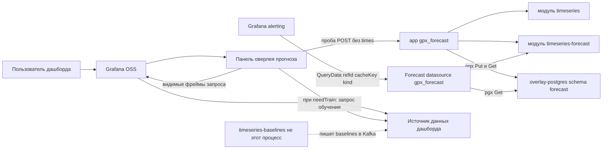

# 1. Контекст системы

Кто общается с плагином и что он не должен хостить. Лендинг приложения — только текст. Configuration хранит DSN снимка и не вызывает `/forecast`. Видимый запрос панели идёт всегда. Второй запрос источника (обучение) — только при `needTrain` или Retrain.

Grafana alerting ходит не в панель, а во вложенный источник **Forecast** (`QueryData`): он только `Restore` + `ForecastRange` по `cacheKey`, никогда не обучает. Оба процесса `gpx_forecast` (app и datasource) читают одну таблицу снимков в Postgres.

Рантайм (Compose, Helm) — в `../timeseries-grafana-sandbox/diagrams/`.

