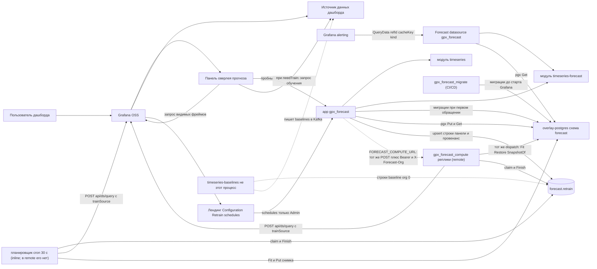

# 1. Контекст системы

Кто взаимодействует с плагином и что плагин не должен размещать у себя. Страницы три: лендинг — только текст, Configuration хранит только retrain-расписание (DSN снимков — конфигурация деплоя) и `/forecast` не вызывает, Retrain schedules показывает и правит строки расписаний. Видимый запрос панели выполняется всегда; второй запрос к источнику данных (обучение) — только при `needTrain` или нажатии Retrain.

Grafana alerting обращается не к панели, а во вложенный источник **Forecast** (`QueryData`): он выполняет только `Restore` + `ForecastRange` по `cacheKey` и никогда не обучает. Оба процесса `gpx_forecast` (app и datasource) читают одну и ту же таблицу снимков в Postgres.

Третий участник — автономный пересчёт по cron (`FORECAST_RETRAIN_CRON`, тик 30 с): он забирает **свои** строки `forecast.retrain` (`scope=panel`, своя организация) через `FOR UPDATE SKIP LOCKED`, тянет фреймы через `/api/ds/query` самой Grafana по сохранённому `trainSource`, обучает, пишет снимок и завершает обработку строки. Строки `scope=baseline` (`org_id = 0`, видны во всех организациях, опознаются только по `metric_hash`) пишет и завершает соседний процесс `timeseries-baselines`; DDL схемы выполняет единый движок миграций в `pkg/store` — его запускает и плагин при первом обращении к хранилищу, и отдельная утилита `gpx_forecast_migrate` для CI/CD до старта Grafana. Ошибка планировщика не влияет ни на запрос панели, ни на alerting.

Где обучать и тикать — одна переменная деплоя. Пока `FORECAST_COMPUTE_URL` пуст, всё как выше: и fit, и тикер живут в процессе app (inline). Стоит задать URL — app перестаёт обучать и **не запускает тикер**: он пересылает каждый `POST /forecast` (пробный запрос тоже) в сервис `gpx_forecast_compute` как есть, добавляя `Authorization: Bearer <compute_token>` и `X-Forecast-Org` той организации, которую аутентифицировала Grafana, и отдаёт ответ сервиса байт в байт. Панель, URL ресурса и форма ответа при этом не меняются; alerting `QueryData` и страница расписаний читают тот же Postgres и работают даже при лежащем сервисе. Проверки размера тела остаются в плагине и выполняются **до** пересылки, недоступный сервис — HTTP 502, тихой локальной подгонки нет. Обучающие фреймы сервис тянет через `/api/ds/query` самой Grafana (в отдельном контейнере или поде loopback плагина на Grafana не указывает — нужен `FORECAST_GRAFANA_URL`), а N его реплик безопасны: `FOR UPDATE SKIP LOCKED` отдаёт каждую просроченную строку ровно одной из них.

Рантайм (Compose, Helm) — в `../timeseries-grafana-sandbox/diagrams/`; планировщик подробнее — в [13-retrain-scheduler.md](13-retrain-scheduler.md).

```mermaid
flowchart LR
  User["Пользователь дашборда"]
  Grafana["Grafana OSS"]
  Panel["Панель оверлея прогноза"]
  Pages["Лендинг Configuration Retrain schedules"]
  AppBE["app gpx_forecast"]
  Sched["планировщик cron 30 с (inline; в remote его нет)"]
  Compute["gpx_forecast_compute реплики (remote)"]
  DSBE["Forecast datasource gpx_forecast"]
  Alert["Grafana alerting"]
  DS["Источник данных дашборда"]
  PG["overlay-postgres схема forecast"]
  Migrate["gpx_forecast_migrate (CI/CD)"]
  RT[("forecast.retrain")]
  TS["модуль timeseries"]
  FC["модуль timeseries-forecast"]
  Worker["timeseries-baselines не этот процесс"]

  User --> Grafana
  Grafana --> Panel
  Grafana --> DS
  Grafana --> Pages
  Panel -->|"запрос видимых фреймов"| Grafana
  Panel -->|"пробный POST без times"| AppBE
  Panel -->|"при needTrain: запрос обучения"| DS
  Alert -->|"QueryData refId cacheKey kind"| DSBE
  Pages -->|"schedules только Admin"| AppBE
  AppBE --> TS
  AppBE --> FC
  DSBE --> FC
  AppBE -->|"миграции при первом обращении"| PG
  Migrate -->|"миграции до старта Grafana"| PG
  AppBE -->|"pgx Put и Get"| PG
  DSBE -->|"pgx Get"| PG
  AppBE -->|"upsert строки панели и провенанс"| RT
  AppBE -.->|"FORECAST_COMPUTE_URL: тот же POST плюс Bearer и X-Forecast-Org"| Compute
  Compute -->|"тот же dispatch: Fit Restore SnapshotOf"| PG
  Compute -->|"claim и Finish"| RT
  Compute -->|"POST api/ds/query с trainSource"| Grafana
  Sched -->|"claim и Finish"| RT
  Sched -->|"POST api/ds/query с trainSource"| Grafana
  Sched -->|"Fit и Put снимка"| PG
  Worker -.->|"строки baseline org 0"| RT
  Worker -.->|"пишет baselines в Kafka"| DS
```
