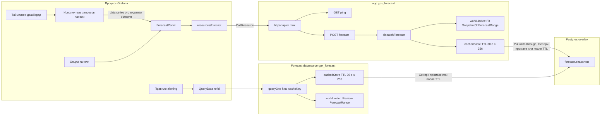

# 2. Устройство плагина

Grafana загружает один app-плагин с вложенной панелью, вложенным источником данных и Go-процессами ресурсов. Бинарник один (`gpx_forecast`), но Grafana запускает его дважды: как бэкенд app (`CallResource /forecast`) и как бэкенд Forecast datasource (`QueryData`). Общего состояния в памяти между ними нет — общая только таблица снимков в Postgres.

Лендинг живёт в том же процессе Grafana, но не на пути оверлея. Configuration пишет DSN снимка (`jsonData` / `secureJsonData`); env `FORECAST_STORE_*` перекрывает поля в процессе `gpx_forecast`.

| Часть | ID / путь | Роль |
| --- | --- | --- |
| App | `eduardkolotushin-forecast-app` | Метаданные, навигация, Go-бэкенд |
| Вложенная панель | `eduardkolotushin-forecast-panel` | Визуализация оверлея; проба затем опциональный train |
| Вложенный источник | `eduardkolotushin-forecast-datasource` | `QueryData` для alerting: Restore по `cacheKey`, промах — ошибка |
| Ресурс | `POST /api/plugins/.../resources/forecast` | Restore или Fit + `ForecastRange` |
| Лимиты | `workLimiter` (4 по умолчанию), `MAX_TRAIN_POINTS` 100k, тело 16 MiB | 429 при занятости, 413 при переполнении; только CPU-работа под семафором |
| Снимок | `SnapshotStore` = TTL-кэш над `forecast.snapshots` (pgx) | Org-scoped JSONB; в процессе ≤ 256 записей, TTL 30 с |
| Бинарник бэкенда | `gpx_forecast` | `pkg/main.go` → `plugin.NewApp` или `plugin.NewDatasource` |

Get/Put в Postgres выполняются **вне** семафора: медленная база не занимает слоты вычислений и не превращается в 429.
