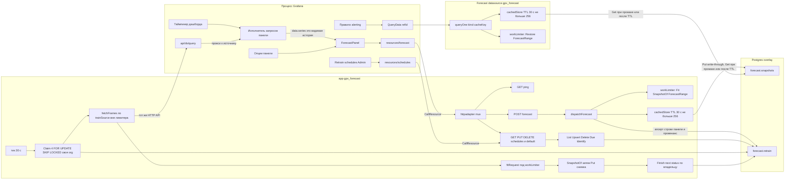

# 2. Устройство плагина

Grafana загружает один app-плагин с вложенной панелью, вложенным источником данных и Go-процессами ресурсов. Бинарник один (`gpx_forecast`), но Grafana запускает его дважды: как бэкенд app (`CallResource /forecast` и `/schedules`) и как бэкенд Forecast datasource (`QueryData`). Общего состояния в памяти между ними нет — общие только таблицы в Postgres.

Страницы живут в процессе Grafana: лендинг и Configuration не на пути оверлея, Retrain schedules ходит в ресурс `/schedules`. Configuration пишет DSN снимка (`jsonData` / `secureJsonData`); env `FORECAST_STORE_*` перекрывает поля в процессе `gpx_forecast`.

Планировщик — горутина процесса app. Она не мешает запросам панели: `/api/ds/query` и `Put` снимка идут **вне** семафора вычислений, под ним только сам `fitRequest`.

| Часть | ID / путь | Роль |
| --- | --- | --- |
| App | `eduardkolotushin-forecast-app` | Метаданные, навигация, Go-бэкенд, планировщик |
| Вложенная панель | `eduardkolotushin-forecast-panel` | Визуализация оверлея; проба затем опциональный train |
| Вложенный источник | `eduardkolotushin-forecast-datasource` | `QueryData` для alerting: Restore по `cacheKey`, промах — ошибка |
| Ресурсы | `POST /forecast`, `GET\|PUT\|DELETE /schedules`, `POST /schedules/default`, `GET ping` | `/schedules*` под Admin, остальное без ограничений |
| Планировщик | `retrain.go`: тик 30 с, батч 4, lease 5 мин | `Claim` → `/api/ds/query` → `fitRequest` → `Put` → `Finish` |
| Расписания | `forecast.retrain`, PK `(scope, org_id, key)` | Спека панели = `trainSource` + модель; `spec` наружу не отдаётся, наружу идёт производный `source` |
| Лимиты | `workLimiter` (4 по умолчанию), `MAX_TRAIN_POINTS` 100k, тело 16 MiB, тело `/api/ds/query` 64 KiB | 429 при занятости, 413 при переполнении; только CPU-работа под семафором |
| Снимок | `SnapshotStore` = TTL-кэш над `forecast.snapshots` (pgx) | Org-scoped JSONB; в процессе ≤ 256 записей, TTL 30 с |
| Бинарник бэкенда | `gpx_forecast` | `pkg/main.go` → `plugin.NewApp` или `plugin.NewDatasource` |

Get/Put в Postgres выполняются **вне** семафора: медленная база не занимает слоты вычислений и не превращается в 429. Так же снаружи стоит и `fetchFrames`: слот Fit достаётся только вычислению.
