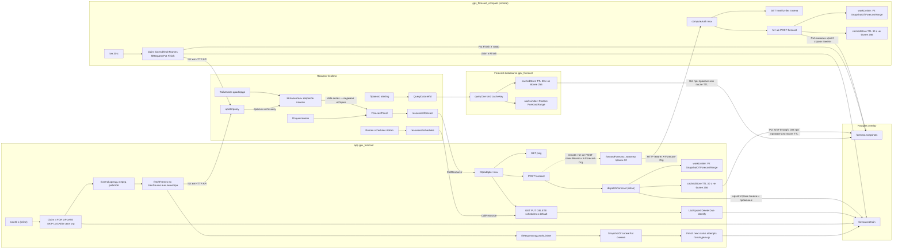

# 2. Устройство плагина

Grafana загружает один app-плагин с вложенной панелью, вложенным источником данных и Go-бэкендами ресурсов. Бинарник один (`gpx_forecast`), но Grafana запускает его дважды: как бэкенд app (`CallResource` `/forecast` и `/schedules`) и как бэкенд Forecast datasource (`QueryData`). Общего состояния в памяти между ними нет — общие только таблицы в Postgres.

Третий процесс — не от Grafana: `gpx_forecast_compute` (`cmd/compute`) поднимает те же обработчики по HTTP и нужен, когда обучать и тикать должно отдельно от Grafana. Grafana о нём не знает: URL задаётся плагину (`FORECAST_COMPUTE_URL`, ниже — режим **remote**), и тогда app-процесс пересылает ему `/forecast`, а сам не обучает и не тикает. Свой `FORECAST_COMPUTE_URL` сервис игнорирует, поэтому переслать запрос самому себе он не может по построению.

Страницы работают в процессе Grafana: лендинг и Configuration находятся вне пути оверлея, а Retrain schedules обращается к ресурсу `/schedules`. Configuration сохраняет только default retrain schedule (`jsonData.retrainCron` / `retrainTimezone`); DSN снимков задаётся деплоем (env `FORECAST_STORE_*` / ini / provisioned jsonData) — полей стора на странице нет.

Планировщик — горутина того процесса, где он живёт: app в inline-режиме, `gpx_forecast_compute` в remote. Она не мешает запросам панели: `/api/ds/query` и `Put` снимка идут **вне** семафора вычислений, под ним выполняется только сам `fitRequest`.

| Часть | ID / путь | Роль |
| --- | --- | --- |
| App | `eduardkolotushin-forecast-app` | Метаданные, навигация, Go-бэкенд, планировщик (inline) |
| Вложенная панель | `eduardkolotushin-forecast-panel` | Визуализация оверлея: сначала пробный запрос, затем (при необходимости) обучение |
| Вложенный источник | `eduardkolotushin-forecast-datasource` | `QueryData` для alerting: Restore по `cacheKey`, промах — ошибка |
| Compute-сервис | `gpx_forecast_compute` (`cmd/compute`) | Тот же `/forecast` и тот же тикер, когда задан `FORECAST_COMPUTE_URL`: процесс env only, без токена не стартует, монтирует `/forecast`, `/ping` и `/healthz` |
| Ресурсы | `POST /forecast`, `GET\|PUT\|DELETE /schedules`, `POST /schedules/default`, `GET ping` | `/schedules*` требуют прав Admin, остальное без ограничений. У compute-сервиса `/schedules` нет — расписания остаются в плагине |
| Планировщик | `retrain.go`: тик 30 с, батч 4, аренда 6 мин (производная: батч × таймаут fetch + таймаут fetch + 1 мин), откат `min(аренда × 2^(attempts−1), FORECAST_RETRAIN_RETRY_MAX)` | `Claim` → `Extend` → `/api/ds/query` → `fitRequest` → `Put` → `Finish`. В remote-режиме тикает compute-сервис, а app не тикает вовсе |
| Расписания | `forecast.retrain`, uuid PK `id`, `UNIQUE (scope, org_id, key)`, `attempts` | Спека панели = `trainSource` + модель; `spec` наружу не отдаётся — отдаётся производный `source` |
| Лимиты | `workLimiter` (4 слота inline, 32 у remote-прокси), `MAX_TRAIN_POINTS` 100k, окно вывода 1e6 точек, тело 16 MiB, `trainSource` 1 MiB, JSON одного запроса 64 KiB (путь `QueryData`) | 429 при занятых слотах, 413 при превышении лимитов; только CPU-работа под семафором — в remote под ним пересылка, а не fit |
| Снимок | `SnapshotStore` = TTL-кэш над `forecast.snapshots` (pgx) | JSONB с областью организации; в процессе не более 256 записей, TTL 30 с |
| Бинарник бэкенда | `gpx_forecast` | `pkg/main.go` → `plugin.NewApp` или `plugin.NewDatasource` |

```mermaid
flowchart LR
  subgraph grafana["Процесс Grafana"]
    Dash["Таймпикер дашборда"] --> PQ["Исполнитель запросов панели"]
    PQ -->|"data.series — видимая история"| Overlay["ForecastPanel"]
    Opts["Опции панели"] --> Overlay
    Overlay --> HTTP["resources/forecast"]
    Rule["Правило alerting"] --> QD["QueryData refId"]
    Page["Retrain schedules Admin"] --> HTTP2["resources/schedules"]
    DSAPI["api/ds/query"]
  end

  subgraph app["app gpx_forecast"]
    Mux["httpadapter mux"] --> Ping["GET ping"]
    Mux --> Fcast["POST forecast"]
    Mux --> Res["GET PUT DELETE schedules и default"]
    Fcast --> Dispatch["dispatchForecast (inline)"]
    Fcast -.->|"remote: тот же POST плюс Bearer и X-Forecast-Org"| Fwd["forwardForecast: лимитер прокси 32"]
    Dispatch --> Lim1["workLimiter: Fit SnapshotOf ForecastRange"]
    Dispatch --> C1["cachedStore TTL 30 с не более 256"]
    Res --> Rows["List Upsert Delete Due Identify"]
    Tick["тик 30 с (inline)"] --> Claim["Claim 4 FOR UPDATE SKIP LOCKED своя org"]
    Claim --> Extend["Extend аренды перед работой"]
    Extend --> Fetch["fetchFrames по trainSource вне лимитера"]
    Fetch --> Fit2["fitRequest под workLimiter"]
    Fit2 --> Put2["SnapshotOf затем Put снимка"]
    Put2 --> Finish["Finish next status attempts по владельцу"]
  end

  subgraph compute["gpx_forecast_compute (remote)"]
    CAMux["computeAuth mux"] --> CAHealth["GET healthz без токена"]
    CAMux --> CADisp["тот же POST forecast"]
    CADisp --> CALim["workLimiter: Fit SnapshotOf ForecastRange"]
    CADisp --> CAC1["cachedStore TTL 30 с не более 256"]
    CATick["тик 30 с"] --> CAWork["Claim Extend fetchFrames fitRequest Put Finish"]
  end

  subgraph dsproc["Forecast datasource gpx_forecast"]
    Q["queryOne kind cacheKey"] --> C2["cachedStore TTL 30 с не более 256"]
    Q --> Lim2["workLimiter: Restore ForecastRange"]
  end

  subgraph store["Postgres overlay"]
    Snap["forecast.snapshots"]
    Ret["forecast.retrain"]
  end

  HTTP -->|"CallResource"| Mux
  HTTP2 -->|"CallResource"| Res
  QD --> Q
  Fwd -->|"HTTP Bearer X-Forecast-Org"| CAMux
  CADisp -->|"Put снимка и upsert строки панели"| Snap
  CAWork -->|"Put Finish и тикер"| Snap
  CAWork -->|"claim и Finish"| Ret
  CAWork -->|"тот же HTTP API"| DSAPI
  C1 -->|"Put write-through, Get при промахе или после TTL"| Snap
  C2 -->|"Get при промахе или после TTL"| Snap
  Dispatch -->|"upsert строки панели и провенанс"| Ret
  Rows --> Ret
  Claim --> Ret
  Finish --> Ret
  Fetch -->|"тот же HTTP API"| DSAPI
  DSAPI -->|"прокси к источнику"| PQ
```

Get/Put в Postgres выполняются **вне** семафора: медленная база не занимает слоты вычислений и не превращается в 429. `fetchFrames` тоже остаётся снаружи: слот семафора достаётся только вычислению. В remote-режиме под семафором плагина уже не вычисление, а пересылка, поэтому его умолчание — 32 слота, а не 4: здесь слот это сокет и запрос к сервису, и многопанельный дашборд не должен упираться в 429 на прокси. Слоты самого fit ограничивает `FORECAST_MAX_INFLIGHT` сервиса.
