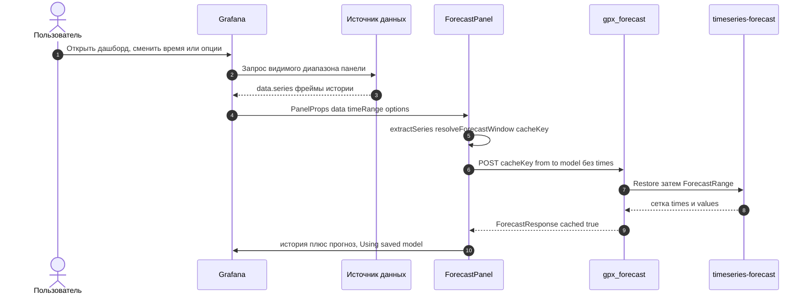
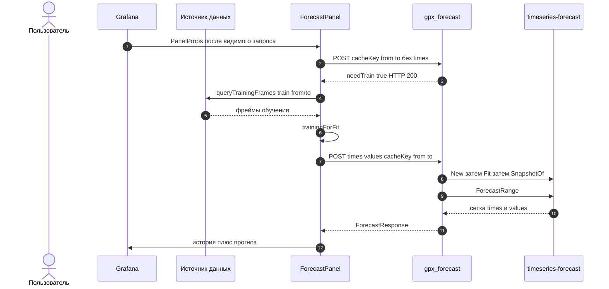
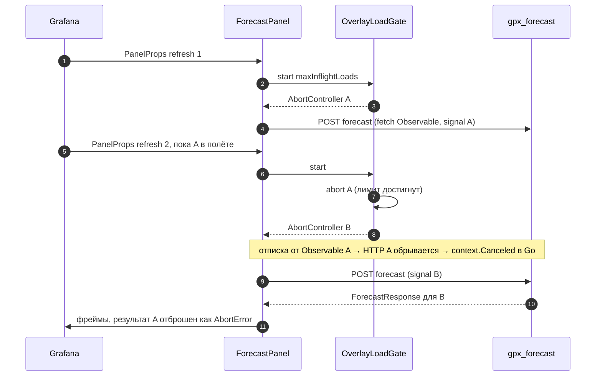

# 3. Последовательность оверлея

К моменту монтирования `ForecastPanel` Grafana уже выполнила запрос видимого диапазона панели. Панель не переобучает модель при каждом обновлении: сначала отправляется POST без `times` (`cacheKey` + окно прогноза). Обучающий запрос к источнику данных — один на панель и только если пришёл `needTrain` или нажат Retrain; `needTrain` приходит и тогда, когда у строки расписания этой панели подошёл срок (её переобучит либо планировщик, либо сама панель — см. [13-retrain-scheduler.md](13-retrain-scheduler.md)).

Источник: `src/forecast-panel/overlayLoad.ts`, `ForecastPanel.tsx`.

## Попадание в снимок (без обучения)

Пробный запрос отправляется для каждого видимого ряда. Если попали все ряды, `queryTrainingFrames` не вызывается.

## Промах или Retrain (один train на панель)

Retrain пропускает пробный запрос (иначе ряды с `needTrain` накапливались бы); затем выполняется один `queryTrainingFrames`.

HTTP 200 при промахе нужен, чтобы `getBackendSrv` не бросал исключение. Пустое обучение — `REASON_TRAIN_EMPTY`, без подстановки видимого ряда.

Пробный запрос без `times` заодно переносит провенанс панели в уже существующую строку расписания (`Identify`), а успешный fit перезаписывает её целиком через upsert: спека = `trainSource` + модель, cron и enabled администратора не сбрасываются. Ни одна из этих записей в `forecast.retrain` не становится ошибкой оверлея — только записью в логе.

## Отмена устаревшей загрузки

Каждый `load` получает `AbortController` из `OverlayLoadGate` (опция `maxInflightLoads`, по умолчанию 1). Новое обновление или смена опций отменяют самый старый запрос. Отмена — не просто флаг: `postResource` и `queryTrainingFrames` идут через `abortableLastValue`, который отписывается от Observable у `getBackendSrv().fetch` / `ds.query`; RxJS `fromFetch` при этом обрывает HTTP-запрос, бэкенд видит `context.Canceled` и освобождает слот лимитера.

Источник: `src/forecast-panel/abortable.ts`, `overlayInflight.ts`.

