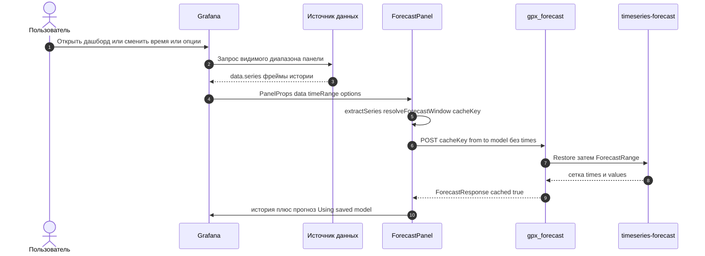
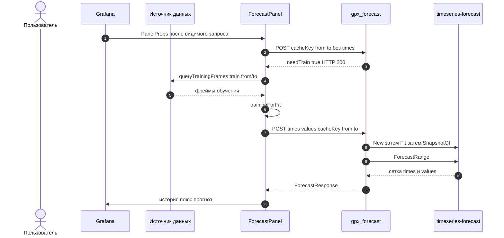

# 3. Последовательность оверлея

К моменту монтирования `ForecastPanel` Grafana уже запросила видимый диапазон панели. Панель не учит модель на каждом refresh: сначала POST без `times` (`cacheKey` + окно прогноза). Обучающий запрос источника — один на панель и только если есть `needTrain` или нажат Retrain.

Источник: `src/forecast-panel/overlayLoad.ts`, `ForecastPanel.tsx`.

## Попадание в снимок (без обучения)



Проба на каждый видимый ряд. Если все попали — `queryTrainingFrames` не вызывается.

## Промах или Retrain (один train на панель)

Retrain пропускает пробу. Иначе ряды с `needTrain` копятся; затем один `queryTrainingFrames`.



HTTP 200 на промахе нужен чтобы `getBackendSrv` не бросал исключение. Пустой train — `REASON_TRAIN_EMPTY`, без подстановки видимого ряда.

## Отмена устаревшей загрузки

Каждый `load` получает `AbortController` из `OverlayLoadGate` (опция `maxInflightLoads`, по умолчанию 1). Новый refresh или смена опций отменяет самый старый. Отмена — не просто флаг: `postResource` и `queryTrainingFrames` идут через `abortableLastValue`, который отписывается от Observable `getBackendSrv().fetch` / `ds.query`; RxJS `fromFetch` при этом обрывает HTTP-запрос, бэкенд видит `context.Canceled` и освобождает слот лимитера.

Источник: `src/forecast-panel/abortable.ts`, `overlayInflight.ts`.

```mermaid
sequenceDiagram
  autonumber
  participant Grafana
  participant Panel as ForecastPanel
  participant Gate as OverlayLoadGate
  participant BE as gpx_forecast

  Grafana->>Panel: PanelProps refresh 1
  Panel->>Gate: start maxInflightLoads
  Gate-->>Panel: AbortController A
  Panel->>BE: POST forecast (fetch Observable, signal A)
  Grafana->>Panel: PanelProps refresh 2 пока A в полёте
  Panel->>Gate: start
  Gate->>Gate: abort A (лимит достигнут)
  Gate-->>Panel: AbortController B
  Note over Panel,BE: отписка от Observable A → HTTP A обрывается → context.Canceled в Go
  Panel->>BE: POST forecast (signal B)
  BE-->>Panel: ForecastResponse для B
  Panel->>Grafana: фреймы; результат A отброшен как AbortError
```
