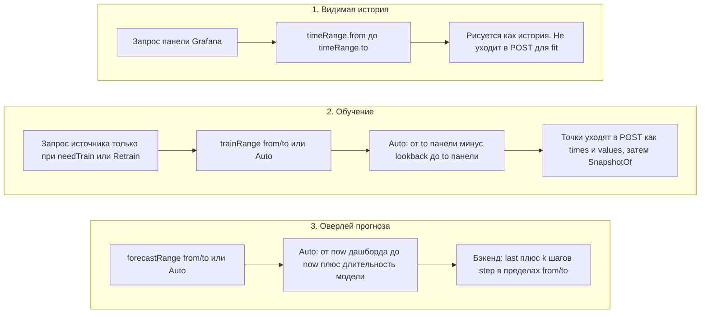

# 4. Три независимых часа

Отображение, обучение и прогноз — три разных окна. Их смешение — частая причина пустого оверлея.

В ключ снимка попадают **сырые** строки `trainRange.from` / `to` (и устаревший `lookback`), а не unix ms. Абсолютные строки задаются настенным временем (wall clock) в **часовой зоне дашборда** (как у таймпикера Grafana), а не браузера. Автозначения вроде `now-21d` не инвалидируют снимок, когда `now` смещается. Модель может отставать от текущего времени — до нажатия Retrain.

**Авто-lookback обучения** (конец окна — `to` панели, а не `now` дашборда):

| Модель | Lookback |
| --- | --- |
| baseline minute-of-week или hour-of-week | 21d |
| baseline hour | 14d |
| baseline day | 56d |
| seasonal naive | 14d |
| naive, mean, drift, SES, Holt | 7d |

**Авто-длительность прогноза** (начало — Grafana `now`, с учётом `nowDelay`):

| Модель | Длительность |
| --- | --- |
| baseline minute-of-week или hour-of-week | 6h |
| baseline hour | 24h |
| baseline day | 7d |
| seasonal naive | 24h |
| naive, mean, drift, SES, Holt | 6h |

Устаревший `lookback` (`15d`, `48h`) учитывается только если `trainRange` никогда не сохранялся. Явно пустое значение и Auto в пикере его игнорируют. Смена запроса, модели или строк `trainRange`, как и нажатие Retrain, вызывают новый fit.
