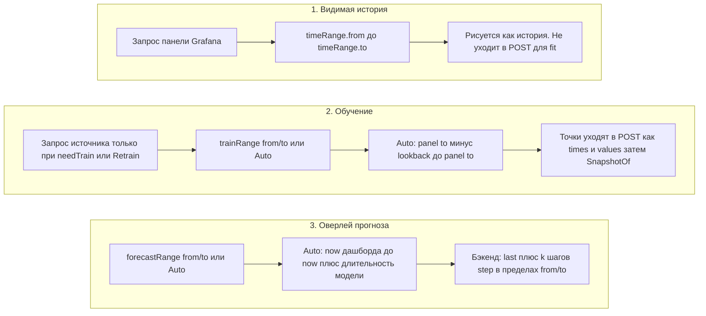

# 4. Три независимых часов

Отображение, обучение и прогноз — три разных окна. Их смешение — обычная причина пустого оверлея.

Ключ снимка берёт **сырые** строки `trainRange.from` / `to` (и устаревший `lookback`), не unix ms. Абсолютные строки — стенные часы в **таймзоне дашборда** (как у таймпикера Grafana), не в timezone браузера. Auto вроде `now-21d` не инвалидирует снимок когда ползёт `now`. Модель может отставать от текущего времени до Retrain.

**Авто-lookback обучения** (конец — `to` панели, не `now` дашборда):

| Модель | Lookback |
| --- | --- |
| baseline minute-of-week или hour-of-week | 21d |
| baseline hour | 14d |
| baseline day | 56d |
| seasonal naive | 14d |
| naive, mean, drift, SES, Holt | 7d |

**Авто-длительность прогноза** (старт — Grafana `now`, с учётом `nowDelay`):

| Модель | Длительность |
| --- | --- |
| baseline minute-of-week или hour-of-week | 6h |
| baseline hour | 24h |
| baseline day | 7d |
| seasonal naive | 24h |
| naive, mean, drift, SES, Holt | 6h |

Устаревший `lookback` (`15d`, `48h`) действует только если `trainRange` никогда не сохраняли. Явно пустой / Auto-пикер его игнорирует. Смена строк запроса / модели / trainRange или Retrain — новый fit.
