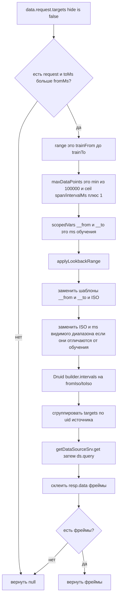

# 5. Перепись запроса обучения

`queryTrainingFrames` клонирует те же targets панели, фиксирует границы времени на окно обучения и группирует по UID источника.

Вызывается из `loadOverlayForecasts` **только** если проба вернула `needTrain` хотя бы для одного ряда или пользователь нажал Retrain. Refresh с живым снимком этот путь не проходит.

Druid SQL часто вшивает видимый диапазон литералами, поэтому нужна JSON-перепись в `applyLookbackRange`. `maxDataPoints` считается по длине окна обучения, не по диапазону дашборда.

Источник: `src/forecast-panel/overlayLoad.ts`, `trainQuery.ts`, `lookback.ts`.

