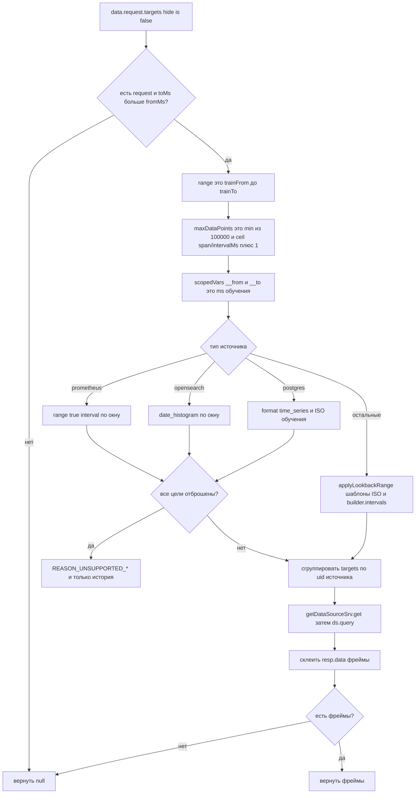

# 5. Перепись запроса обучения

`queryTrainingFrames` клонирует те же targets панели, фиксирует границы времени на окно обучения и группирует по UID источника. Перепись идёт по типу источника (`rewriteTrainTargets`), поэтому в `pkg/` нет ни одного клиента источника данных: бэкенд повторяет то, что панель уже отправила.

Вызывается из `loadOverlayForecasts` **только** если проба вернула `needTrain` хотя бы для одного ряда или пользователь нажал Retrain. Refresh с живым снимком этот путь не проходит.

Типы и их перепись:

| Тип источника | Что делает перепись |
| --- | --- |
| `prometheus` | `range: true`, `instant: false`, `exemplar: false` и `interval` по окну обучения; instant-цель отбрасывается с причиной |
| `grafana-opensearch-datasource` | шаг `date_histogram` по окну обучения; логи, raw, traces и PPL без `time_series` отбрасываются с причиной |
| `postgres` и `grafana-postgresql-datasource` | `format: time_series`; ISO видимого диапазона заменяется на ISO обучения, если в SQL нет макросов `$__timeFilter` |
| остальные (Druid, TestData) | `applyLookbackRange`: шаблоны `__from` / `__to` / ISO / ms и `builder.intervals` |

Те же targets уезжают в бэкенд в `trainSource.queries` как есть, а однострочная сводка (`summarizeTrainTargets`: `PromQL:`, `PPL:`, `Lucene:`, `SQL:`, `Druid SQL:` или `Druid:` с таблицей) попадает в строку расписания как `querySummary`.

Druid SQL часто вшивает видимый диапазон литералами, поэтому нужна JSON-перепись в `applyLookbackRange`. `maxDataPoints` считается по длине окна обучения, не по диапазону дашборда.

Источник: `src/forecast-panel/overlayLoad.ts`, `trainQuery.ts`, `trainRewrite.ts`, `lookback.ts`.

