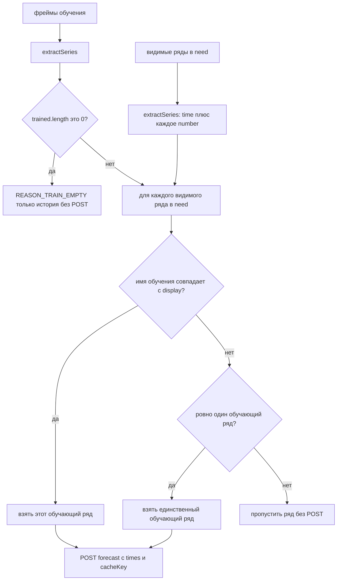

# 6. Сопоставление рядов перед POST с times

Этот шаг выполняется только на ветке miss / Retrain, после одного `queryTrainingFrames`.

Каждый видимый числовой ряд, которому нужен fit, получает свой POST с `times`. Обучающие фреймы сопоставляются по имени поля Grafana (`getFieldDisplayName`). Пустое обучение нельзя молча подменять видимым рядом.

`trainingForFit` возвращает `null`, если обучающих рядов нет или при нескольких рядах имя не совпало. Тогда этот видимый ряд пропускается без POST. `REASON_TRAIN_EMPTY` — только когда **нет** извлечённых точек обучения вообще.

`extractSeries` берёт поле времени и каждое числовое поле (широкие фреймы Postgres/Prom).

