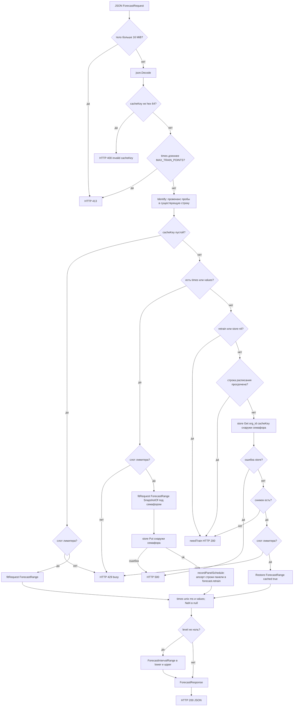

# 7. Поток `POST /forecast`

URL фронтенда: `/api/plugins/eduardkolotushin-forecast-app/resources/forecast`.

Grafana проксирует это в процесс плагина как `CallResource` → mux `/forecast` → `dispatchForecast`.

Лимиты до разбора: тело больше 16 MiB → HTTP 413; `times`/`values` длиннее `MAX_TRAIN_POINTS` (100k) → 413. Семафор `workLimiter` (4 слота по умолчанию, `FORECAST_MAX_INFLIGHT`) занят → HTTP 429 сразу, без очереди. Под семафором только CPU-работа: `Fit`, `SnapshotOf`, `Restore`, `ForecastRange`. `store.Get` и `store.Put` — снаружи, чтобы медленный Postgres не съедал слоты.

Пустой `cacheKey` — старое поведение: нужны `times`, без persist.

Проба: `cacheKey` есть, `times` нет. Попадание — `Restore` + `ForecastRange`, `cached: true`. Промах / нет store / `retrain` / просроченное расписание — `{ needTrain: true }` и HTTP 200. Проба без снимка слот не занимает.

Две записи в `forecast.retrain` идут по краям этого потока и никогда не ломают ответ: проба без `times` и без `retrain` вливает провенанс панели в уже существующую строку (`Identify`), а успешный fit апсертит строку целиком (`recordPanelSchedule`: спека = `trainSource` + модель). Cron и enabled, выставленные админом, при этом сохраняются; ошибка любой из записей — только запись в логе. Подробности — в [13-retrain-scheduler.md](13-retrain-scheduler.md).

Fit: `times` есть — под семафором `Fit*` → `ForecastRange` → `SnapshotOf`; затем `Put` снаружи семафора. Ошибка `Put` — HTTP 500 (прогноз не возвращается молча без сохранения).

Значения по умолчанию в `fitRequest`, если JSON их не прислал: модель `holt`, alpha `0.8`, beta `0.2`, period `7`. Season `""`/`hour` → `SeasonHour`; `week` → hour-of-week; `minute-week` → minute-of-week.

Сетка горизонта (библиотека, не Grafana): метки `last + k×step` для `k ≥ 1`, обрезанные до `[from, to]`. Нет прогноза назад раньше `last+step`. Пустая обрезка → `ErrEmptyRange` (HTTP 400).

Отмена: если панель оборвала запрос, `ctx` в обработчике отменён; ожидание слота и `Put` прекращаются, ответ не пишется.

Источник: `pkg/plugin/resources.go`, `pkg/plugin/forecast.go`, `pkg/plugin/limits.go`, `pkg/plugin/store.go`.

Кэш снимков в `store.Get` — см. [12-snapshot-cache.md](12-snapshot-cache.md).
