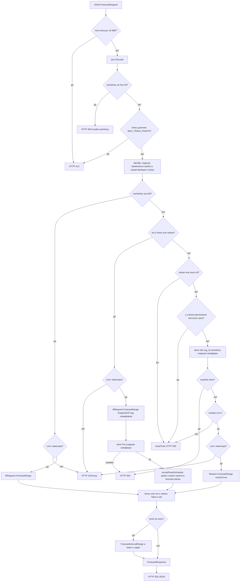

# 7. Поток `POST /forecast`

URL фронтенда: `/api/plugins/eduardkolotushin-forecast-app/resources/forecast`.

Grafana проксирует этот вызов в процесс плагина как `CallResource` → mux `/forecast` → `dispatchForecast`.

Лимиты проверяются до разбора JSON: тело больше 16 MiB → HTTP 413; `times`/`values` длиннее `MAX_TRAIN_POINTS` (100k) → 413. Если семафор `workLimiter` (4 слота по умолчанию, `FORECAST_MAX_INFLIGHT`) занят → HTTP 429 сразу, без очереди. Под семафором выполняется только CPU-работа: `Fit`, `SnapshotOf`, `Restore`, `ForecastRange`. `store.Get` и `store.Put` — снаружи, чтобы медленный Postgres не съедал слоты.

Пустой `cacheKey` — старое поведение: `times` обязательны, снимок не сохраняется.

Пробный запрос: `cacheKey` есть, `times` нет. Попадание — `Restore` + `ForecastRange`, `cached: true`. Промах, отсутствие store, флаг `retrain` или расписание с наступившим сроком — `{ needTrain: true }` и HTTP 200. Пробный запрос без снимка слот не занимает.

Две записи в `forecast.retrain` идут по краям этого потока и никогда не ломают ответ: пробный запрос без `times` и без `retrain` переносит провенанс панели в уже существующую строку (`Identify`), а успешный fit целиком перезаписывает строку через upsert (`recordPanelSchedule`: спека = `trainSource` + модель). Cron и enabled, выставленные администратором, при этом сохраняются; любая ошибка записи — только запись в логе. Подробности — в [13-retrain-scheduler.md](13-retrain-scheduler.md).

Fit: если `times` есть — под семафором выполняются `Fit*` → `ForecastRange` → `SnapshotOf`; затем `Put` вне семафора. Ошибка `Put` — HTTP 500: прогноз не отдаётся без сохранения.

Значения по умолчанию в `fitRequest`, если JSON их не прислал: модель `holt`, alpha `0.8`, beta `0.2`, period `7`. Season `""`/`hour` → `SeasonHour`; `week` → hour-of-week; `minute-week` → minute-of-week.

Сетка горизонта строится библиотекой, а не Grafana: метки `last + k×step` для `k ≥ 1`, обрезанные до `[from, to]`. Прогноз не распространяется назад раньше `last+step`. Если после обрезки не осталось точек — `ErrEmptyRange` (HTTP 400).

Отмена: если панель оборвала запрос, `ctx` в обработчике отменён; ожидание слота и `Put` прекращаются, ответ не отправляется.

Источник: `pkg/plugin/resources.go`, `pkg/plugin/forecast.go`, `pkg/plugin/limits.go`, `pkg/plugin/store.go`.

Кэш снимков в `store.Get` — см. [12-snapshot-cache.md](12-snapshot-cache.md).
