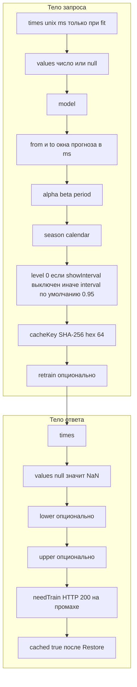

# 8. Тела запроса и ответа

Как панель кладёт полосы на фреймы Grafana:

- Поле значения прогноза, цвет warning
- Скрытые `{name} lower` и `{name} upper`
- `custom.fillBelowTo` на upper → полоса интервала
- `hideFrom.legend/tooltip` на полях границ

Проба не шлёт `times`/`values`. Fit шлёт их вместе с тем же `cacheKey`. `retrain` на бэкенде важен только когда `times` нет.

