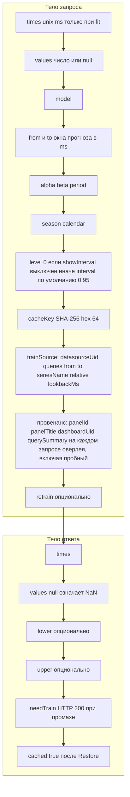

# 8. Тела запроса и ответа

Как панель накладывает полосы неопределённости на фреймы Grafana:

- поле значения прогноза, цвет warning;
- скрытые поля `{name} lower` и `{name} upper`;
- `custom.fillBelowTo` на upper → полоса интервала;
- `hideFrom.legend/tooltip` на полях границ.

Пробный запрос не отправляет `times`/`values`. Fit отправляет их вместе с тем же `cacheKey`. Бэкенд учитывает `retrain` только когда `times` нет.

