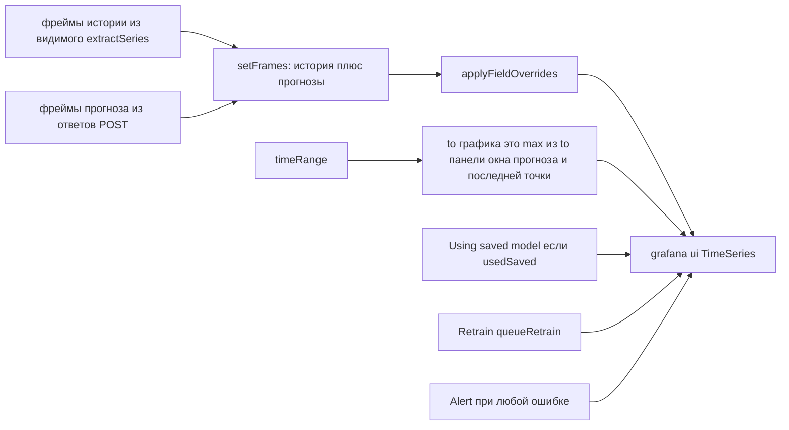

# 9. Сборка графика и граница `to`

Лишние точки обучения не рисуются. Если окно прогноза выходит за диапазон дашборда (типичный Auto `now → now+duration`), граница `to` графика растягивается, чтобы оверлей оставался видимым.

Пустой `data.series` сразу даёт `PanelDataErrorView` (нужны поля time и number) и не вызывает `/forecast`.

При `cached` панель показывает «Using saved model». Кнопка Retrain поднимает флаг и перезапускает `load` (в опциях панели есть Retrain для всех оверлеев этой панели).

