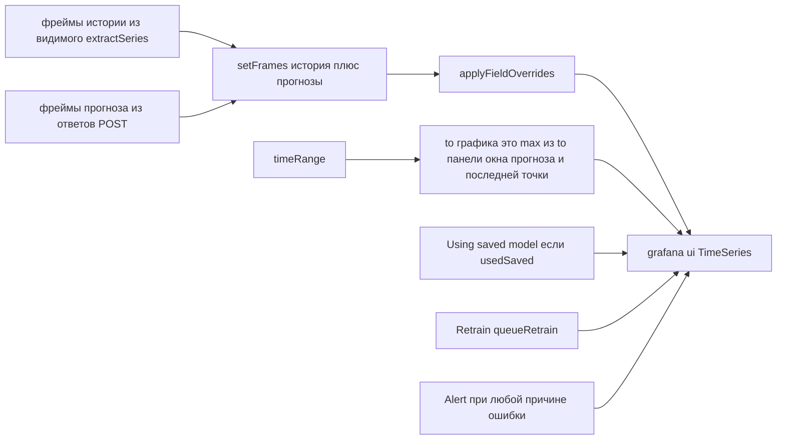

# 9. Сборка графика и граница `to`

Лишние точки обучения не рисуются. Если окно прогноза выходит за диапазон дашборда (типичный Auto `now → now+duration`), `to` графика растягивается, чтобы оверлей был виден.

Пустой `data.series` сразу даёт `PanelDataErrorView` (нужны time и number) и не вызывает `/forecast`.

При `cached` панель показывает «Using saved model». Кнопка Retrain ставит флаг и перезапускает `load` (опции панели — Retrain для всех оверлеев этого поколения).

