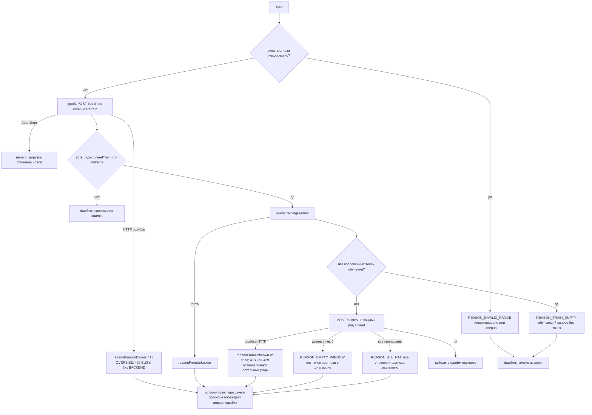

# 10. Пути ошибок и причины

Панель всегда оставляет историю на экране. Она никогда не подгоняет модель молча по видимому ряду, если обучающий запрос пуст.

Побеждает первая ошибка оверлея (`overlayError ?? next`). Успешные ряды всё равно накладываются.

Промах снимка — не ошибка: HTTP 200 и `needTrain`. Ошибка store (DSN задан, Postgres недоступен) — HTTP 500 → `REASON_BACKEND`, без тихого `needTrain`. Store не «умирает» навсегда: следующая загрузка повторит подключение (не чаще раза в 5 с), так что после подъёма Postgres оверлей восстанавливается сам.

Лимиты нагрузки: HTTP 413 → `REASON_OVERSIZE` / `REASON_TRAIN_TOO_LONG`, HTTP 429 → `REASON_BUSY`. Оба останавливают дальнейшие POST по рядам этой загрузки; авто-повтора нет, следующий refresh пробует снова. Отменённая загрузка (`AbortError`) причиной не считается — её результат просто не рисуется.

400 против 500 на бэкенде — `httpStatusFor` в `forecast.go` (неизвестная модель, неверный cacheKey, пусто, нет частоты, неверные alpha/period/season/calendar/level/range, снимок, несортированные или дублирующиеся времена и т.д. → 400).

Источник: `src/forecast-panel/reasons.ts`, `overlayLoad.ts`, `ForecastPanel.tsx`.

