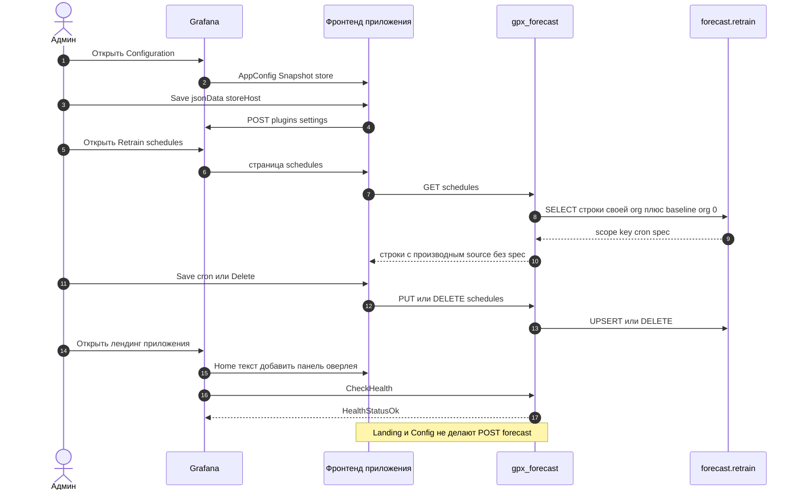

# 11. Страницы app-плагина

Страниц три: лендинг (только текст), Configuration (DSN снимка) и Retrain schedules (таблица `forecast.retrain`, Admin). Оверлей `/forecast` с них не вызывается. `GET /ping` есть (`{"message":"ok"}`), но панель его не вызывает.

Configuration сохраняет `storeHost` / port / database / user / ssl / password через `POST /api/plugins/.../settings`; env `FORECAST_STORE_*` в процессе Grafana перекрывает сохранённые поля.

Retrain schedules (`?page=schedules`) читает `GET /schedules` и правит строки через `PUT` / `DELETE /schedules` и `POST /schedules/default`. Всё под Admin. Таблица показывает `scope` (`panel` или `baseline`), Source, ключ с копированием, cron, timezone, enabled, следующий и последний запуск, `last_status`. Поиск идёт по ключу, заголовку панели, имени ряда и сводке запроса.

Source — это производный `source` из бэкенда, а не спека: `dashboardUid`, `panelId`, `panelTitle` (со ссылкой на `?viewPanel=`), `datasourceUid`, `seriesName`, `lookback` и однострочная `querySummary`. Спека и объекты запросов наружу не отдаются никогда.

Орг-семантика видна по строке: `panel` — строка этой org, `baseline` — общая для всех org (`org_id = 0`), её cron / timezone / enabled общие, а опознаётся она только ключом `metric_hash`. `baseline` нельзя создать этой страницей (неизвестный ключ — 404), но можно изменить и удалить.

