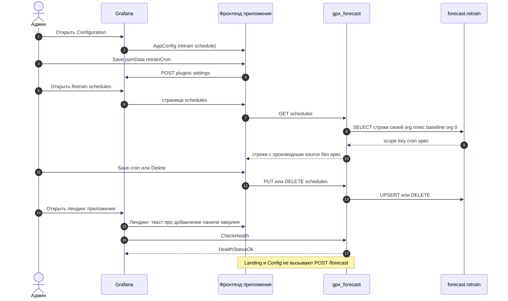

# 11. Страницы app-плагина

Страницы три: лендинг (только текст), Configuration (только retrain-расписание) и Retrain schedules (таблица `forecast.retrain`, права Admin). Оверлей `/forecast` с них не вызывается. `GET /ping` существует (`{"message":"ok"}`), но панель его не использует.

Configuration сохраняет только default retrain schedule (`jsonData.retrainCron` / `retrainTimezone`) через `POST /api/plugins/.../settings`; DSN снимков задаётся деплоем (env `FORECAST_STORE_*` / `GF_PLUGIN_*` / ini / provisioned jsonData) — полей стора на странице нет.

Retrain schedules (`?page=schedules`) читает `GET /schedules` и правит строки через `PUT` / `DELETE /schedules` и `POST /schedules/default`. Всё это требует прав Admin. Таблица показывает `scope` (`panel` или `baseline`), Source, ключ с возможностью копирования, cron, timezone, enabled, следующий и последний запуски, `last_status`. Поиск идёт по ключу, заголовку панели, имени ряда и сводке запроса.

Source — это производный `source` из бэкенда, а не спека: `dashboardUid`, `panelId`, `panelTitle` (со ссылкой на `?viewPanel=`), `datasourceUid`, `seriesName`, `lookback` и однострочная `querySummary`. Спека и объекты запросов наружу не отдаются никогда.

Принадлежность строки организации видна по `scope`: `panel` — строка этой организации, `baseline` — общая для всех организаций (`org_id = 0`), её cron / timezone / enabled общие, а опознаётся она только по ключу `metric_hash`. Строку `baseline` нельзя создать этой страницей (неизвестный ключ — 404), но можно изменить и удалить.

