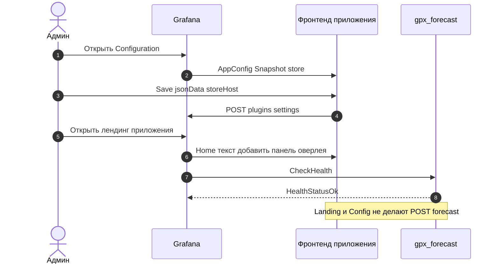

# 11. Страницы app-плагина

Лендинг — только текст. Configuration сохраняет DSN снимка (`storeHost` / port / database / user / ssl / password) через `POST /api/plugins/.../settings`. Оверлей `/forecast` с этих страниц не вызывается. `GET /ping` есть (`{"message":"ok"}`), но оверлей его не вызывает.

Env `FORECAST_STORE_*` в процессе Grafana перекрывает сохранённые поля.

