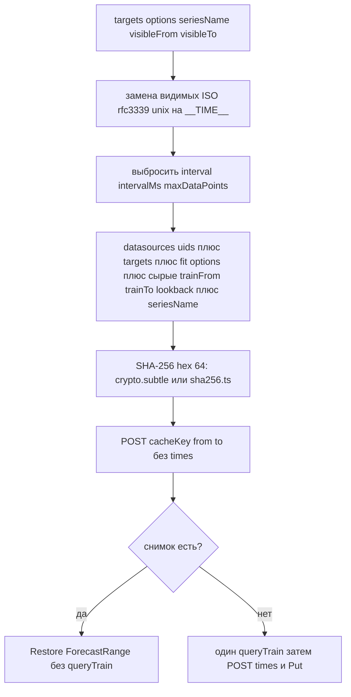
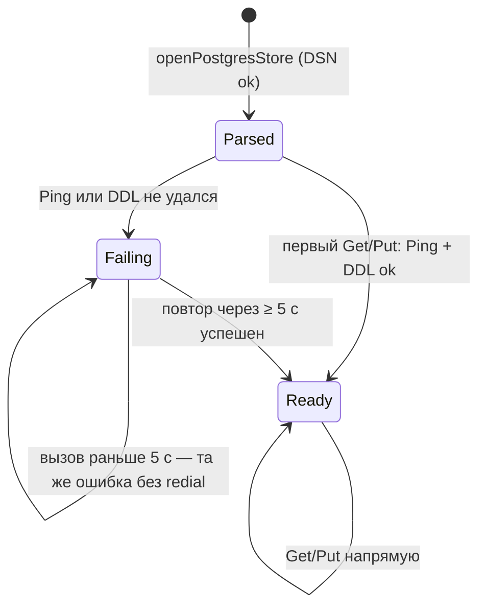

# 12. Снимок и `cacheKey`

Снимок — это `forecast.Snapshot` (типизованный конверт: `v`, `kind`, `last`, `step`, `data`), а не обучающий ряд. Организация берётся из `PluginConfig.OrgID`. Снимки переживают перезапуск Grafana и общие для всех пользователей организации.

Переобучение: кнопка Retrain на оверлее (этот `panelId`) или в опциях панели (`queueRetrainAll`). Смена отпечатка (запрос, модель или строки trainRange) даёт другой `cacheKey` и снова `needTrain`.

В ключ не входят: видимый диапазон дашборда, окно прогноза, `level` / `showInterval`, `interval` / `intervalMs` / `maxDataPoints` цели, а также `trainSource` целиком — его окно и поля опознания (`panelId`, `panelTitle`, `dashboardUid`, `querySummary`). Поэтому upsert расписания никогда не порождает новый снимок (см. [13-retrain-scheduler.md](13-retrain-scheduler.md)).

Перед вычислением хеша видимые значения ISO / rfc3339 / unix ms в targets заменяются на `__TIME__`.

Хеш — SHA-256 через WebCrypto. При доступе к Grafana по plain HTTP (не localhost) `crypto.subtle` недоступен, тогда хеш считает чистая JS-реализация (`sha256.ts`) с тем же результатом, поэтому ключи не зависят от origin.

Источник: `src/forecast-panel/cacheKey.ts`, `src/forecast-panel/sha256.ts`, `pkg/plugin/store.go`, `pkg/plugin/store_postgres.go`.

## Кэш снимков в процессе

`SnapshotStore` = `cachedStore` над `postgresStore`. Каждый процесс `gpx_forecast` (app, Forecast datasource — по одному на реплику Grafana) держит собственный кэш: не более 256 записей, TTL 30 с. `Put` пишет в Postgres и обновляет локальную запись; `Get` после истечения TTL перечитывает Postgres. Поэтому Retrain с оверлея становится виден запросам alerting через ≤ 30 с без перезапуска, а память ограничена (minute-of-week ≈ 20k float в JSON).

## Подключение к Postgres

`openPostgresStore` только разбирает DSN (pgxpool подключается лениво). Первый `Get`/`Put` выполняет `Ping` и `CREATE SCHEMA/TABLE IF NOT EXISTS`; если DDL запрещён, но `SELECT 1 FROM forecast.snapshots` проходит — store считается готовым. Пока Postgres недоступен, каждый вызов возвращает ошибку (HTTP 500 / `REASON_BACKEND`), новая попытка — не чаще раза в 5 с. Плагин, запустившийся раньше базы, начнёт сохранять снимки, как только база станет доступна.

Если DSN нет (пустой host) — сохранение выключено, каждый пробный запрос даёт `needTrain`. Если DSN некорректен (не разбирается) — `errStore`, и все запросы завершаются с 500 до исправления конфигурации.
