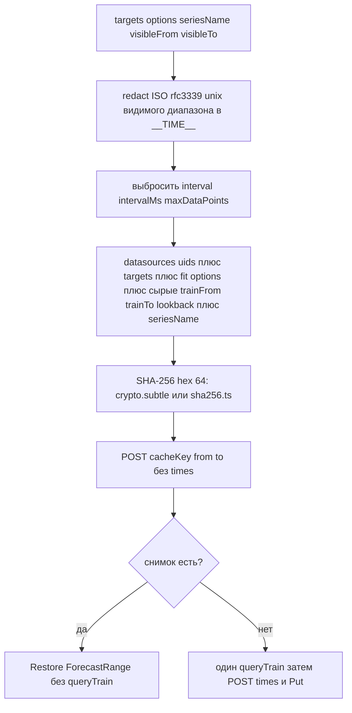
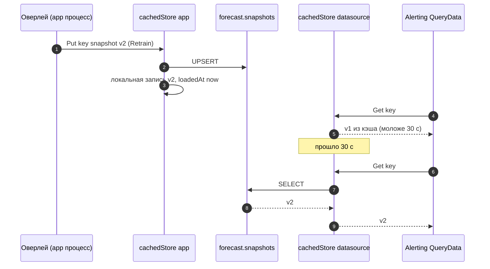
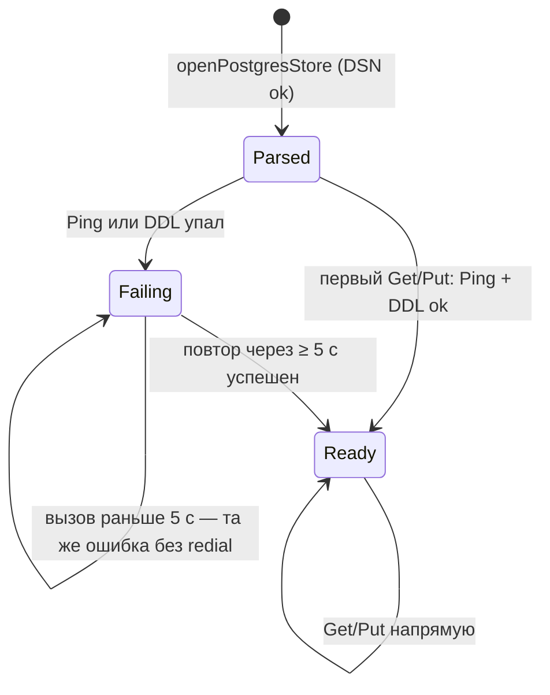

# 12. Снимок и `cacheKey`

Снимок — `forecast.Snapshot` (kind envelope: `v`, `kind`, `last`, `step`, `data`), не обучающий ряд. Org — `PluginConfig.OrgID`. Переживает рестарт Grafana и общий для пользователей org.

Переобучение: кнопка Retrain на оверлее (этот `panelId`) или в опциях панели (`queueRetrainAll`). Смена отпечатка (запрос / модель / строки trainRange) даёт другой `cacheKey` и снова `needTrain`.

Не входят в ключ: видимый диапазон дашборда, окно прогноза, `level` / `showInterval`, `interval` / `intervalMs` / `maxDataPoints` цели, а также `trainSource` целиком — его окно и поля опознания (`panelId`, `panelTitle`, `dashboardUid`, `querySummary`). Апсерт расписания поэтому никогда не плодит новый снимок (см. [13-retrain-scheduler.md](13-retrain-scheduler.md)).

Видимые ISO / rfc3339 / unix ms в targets заменяются на `__TIME__` перед хешем.

Хеш — SHA-256 через WebCrypto; на Grafana по plain HTTP (не localhost) `crypto.subtle` отсутствует, тогда считает чистый JS (`sha256.ts`) с тем же результатом, так что ключи не зависят от origin.

Источник: `src/forecast-panel/cacheKey.ts`, `src/forecast-panel/sha256.ts`, `pkg/plugin/store.go`, `pkg/plugin/store_postgres.go`.

## Кэш снимков в процессе

`SnapshotStore` = `cachedStore` над `postgresStore`. Каждый процесс `gpx_forecast` (app, Forecast datasource, по одному на реплику Grafana) держит свой кэш: не больше 256 записей, TTL 30 с. `Put` пишет в Postgres и обновляет локальную запись; `Get` после TTL перечитывает Postgres. Поэтому Retrain на оверлее виден alerting-запросам через ≤ 30 с без рестарта, а память ограничена (minute-of-week ≈ 20k float в JSON).

## Подключение к Postgres

`openPostgresStore` только разбирает DSN (pgxpool подключается лениво). Первый `Get`/`Put` делает `Ping` и `CREATE SCHEMA/TABLE IF NOT EXISTS`; если DDL запрещён, но `SELECT 1 FROM forecast.snapshots` проходит — store готов. Пока Postgres недоступен, каждый вызов возвращает ошибку (HTTP 500 / `REASON_BACKEND`), новая попытка не чаще раза в 5 с. Плагин, стартовавший до базы, начинает сохранять снимки, как только база поднялась.

Нет DSN (пустой host) — persist выключен, каждая проба `needTrain`. Неверный DSN (не парсится) — `errStore`, все запросы 500 до исправления конфигурации.
