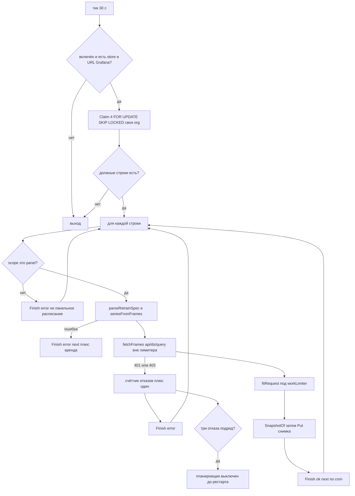
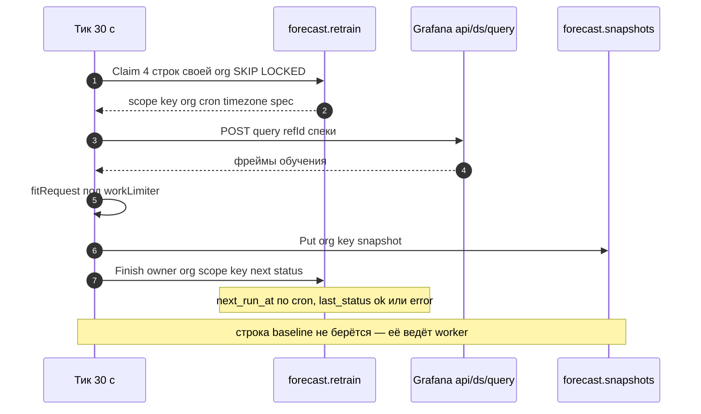

# 13. Автономный пересчёт по cron

Строка `forecast.retrain` со `scope=panel` — это расписание панели. Её заводит апсерт при успешном fit (см. [07-post-forecast.md](07-post-forecast.md)), а планировщик в процессе app сам находит строки, которым пришло время, и обучает их без открытого браузера. Кнопка Retrain и `needTrain` из пробы — тот же путь, только по требованию (см. [03-overlay-sequence.md](03-overlay-sequence.md)).

Что делает один тик:

1. `Claim` — `UPDATE … WHERE scope='panel' AND org_id = <своя org> AND next_run_at <= now` с `FOR UPDATE SKIP LOCKED`, до 4 строк за тик, аренда 5 минут, владелец `host:pid`.
2. `fetchFrames` — `POST /api/ds/query` в Grafana с сохранёнными объектами запросов из спеки (тот же `refId`), таймаут 60 с, тело ответа не больше 64 MiB, тело запроса не больше 64 KiB. **Вне** семафора вычислений: медленный источник не занимает слот Fit.
3. `seriesFromFrames` + `fitRequest` — под `workLimiter` (та же очередь, что у запросов панели).
4. `SnapshotOf` → `Put` в `forecast.snapshots` → `Finish(owner, org, scope, key, next, status)`.

Окно и владелец:

- Окно `relative: true` с `lookbackMs` пересчитывается как `[claim now − lookbackMs, claim now]`, поэтому cron обучает на данных, пришедших после прошлого запуска; иначе воспроизводятся сохранённые `from`/`to` пикера (см. [04-three-clocks.md](04-three-clocks.md)).
- `Finish` пишет `next_run_at` и `last_status` только если `claimed_by` всё ещё этот владелец: протухшая аренда не может закрыть более новый claim. Ошибка откладывает строку на аренду, `errBusy` — на один тик.
- Cron, timezone и enabled, выставленные админом в таблице, переживают переобучение панелью.
- В спеке нет `queries` — `parseRetrainSpec` вернёт ошибку, и строка получит `error: …` вместо fit.

Почему org в ключе: `cacheKey` не зависит от org, поэтому строка принадлежит одной org. Планировщик берёт только строки своей org (`GET /api/org` кэшируется) и обучает их своей учётной записью Grafana, потому что `datasourceUid` разрешается внутри org запроса. Строка другой org остаётся должной для её оверлея: её панель увидит `needTrain` и обучит сама.

Что планировщик **не** делает: он не отвечает за запросы. Ошибка строки — это `last_status` и запись в логе, панель и alerting её не видят. Строки `scope=baseline` (`org_id = 0`) он не трогает: их ведёт `timeseries-baselines` по той же таблице и тому же `FOR UPDATE SKIP LOCKED`.

| Настройка | По умолчанию | Смысл |
| --- | --- | --- |
| `FORECAST_RETRAIN_ENABLED` | `true` | Планировщик стартует в процессе app |
| `FORECAST_RETRAIN_CRON` | `0 3 * * *` | Cron новых строк, если панель не передала свой |
| `FORECAST_RETRAIN_TICK` | `30s` | Как часто процесс ищет должные строки |
| `FORECAST_RETRAIN_LEASE` | `5m` | Аренда claim и откат ошибки |
| `FORECAST_GRAFANA_URL` / `FORECAST_GRAFANA_TOKEN` | — | Куда и с чем ходить в `/api/ds/query` |

Отказ авторизации: три подряд тика с 401/403 (`/api/ds/query` или `/api/org`) выключают планировщик до рестарта с одной записью Error в логе; три отказа должны идти подряд, поэтому редкий сбой не глушит здоровый планировщик. Проверка стоит только на пути планировщика — на запросы панели она не влияет.

Столбцы строки: `scope`, `key`, `org_id`, `cron`, `timezone`, `enabled`, `spec` (JSONB: `trainSource` + модель), `next_run_at`, `last_run_at`, `last_status`, `claimed_by`, `claimed_until`, `updated_at`; PK `(scope, org_id, key)`.

