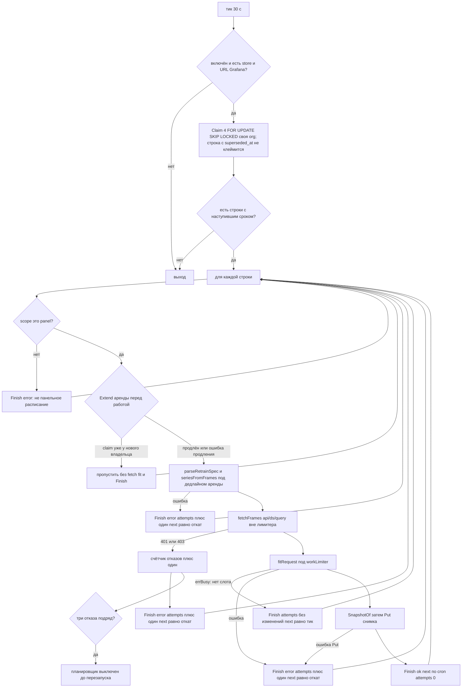
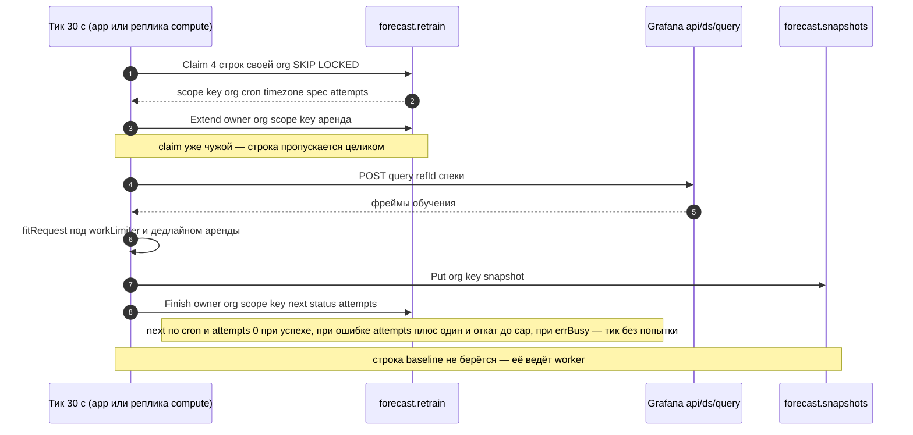

# 13. Автономный пересчёт по cron

Строка `forecast.retrain` со `scope=panel` — это расписание панели. Его создаёт upsert при успешном fit (см. [07-post-forecast.md](07-post-forecast.md)), а планировщик сам находит строки с наступившим сроком и переобучает их без открытого браузера. Он живёт в процессе app (inline) — или, если задан `FORECAST_COMPUTE_URL`, в сервисе `gpx_forecast_compute`: тогда app не тикает вовсе (см. [01-system-context.md](01-system-context.md)), а claim-протокол делает N реплик сервиса корректными — каждую просроченную строку берёт ровно одна из них. Кнопка Retrain и `needTrain` из пробного запроса — тот же путь, но по требованию (см. [03-overlay-sequence.md](03-overlay-sequence.md)).

Что делает один тик:

1. `Claim` — `UPDATE … WHERE scope='panel' AND org_id = <своя org> AND next_run_at <= now` с `FOR UPDATE SKIP LOCKED`, до 4 строк за тик, аренда 6 минут, владелец `host:pid` (в сервисе — `имя пода:pid`).
2. `Extend` — продление **перед** работой, которую оно защищает: строка выполняется под контекстом с дедлайном в одну аренду, поэтому fit не может пережить свой claim (и быть переобучен параллельно другой репликой) и не может быть обрезан на середине. Если `Extend` не нашёл строку, claim уже ушёл к новому владельцу: строка пропускается без fetch, fit и Finish (`retrain claim lost` в Debug), чтобы не перезаписать чужой `next_run_at` и `last_status`. Ошибка `Extend` — запись в логе, строка всё равно обрабатывается: взятый claim её покрывает.
3. `fetchFrames` — `POST /api/ds/query` в Grafana с сохранёнными объектами запросов из спеки (тот же `refId`), таймаут 60 с, тело ответа не больше 64 MiB; своего лимита на тело запроса нет — его размер задаёт сохранённая спека, а `trainSource` ограничен 1 MiB при fit. **Вне** семафора вычислений: медленный источник не занимает слот Fit.
4. `seriesFromFrames` + `fitRequest` — под `workLimiter` (та же очередь, что у запросов панели).
5. `SnapshotOf` → `Put` в `forecast.snapshots` → `Finish(owner, org, scope, key, next, status, attempts)`.

Окно и владелец:

- Окно `relative: true` с `lookbackMs` пересчитывается как `[now момента claim − lookbackMs, now момента claim]`, поэтому cron обучается на данных, пришедших после прошлого запуска; иначе воспроизводятся сохранённые пикером `from`/`to` (см. [04-three-clocks.md](04-three-clocks.md)).
- `Finish` пишет `next_run_at`, `last_status` и `attempts` только если `claimed_by` всё ещё этот владелец — предикат ровно `claimed_by = owner`, без `IS NULL`: протухшая аренда не может закрыть более новый claim, а ноль обновлённых строк это `retrain claim lost` в Debug, а не ошибка.
- Ошибка и занятость ведут себя по-разному. Ошибка (в том числе cron или timezone, который перестал разбираться) — `attempts` увеличивается и `next = now + min(аренда × 2^(attempts−1), FORECAST_RETRAIN_RETRY_MAX)`: хронически сломанная строка успокаивается на потолке вместо повтора раз в аренду навсегда, а счётчик попыток виден прямо в `last_status` как `error: … (attempt N)`. `errBusy` (нет свободного слота вычислений) — строка не запускалась, поэтому попытка **не** сжигается и `next = now + тик`: перегрузка не должна откладывать здоровую строку на аренду.
- Cron, timezone и enabled, выставленные администратором в таблице, переживают переобучение панелью.
- Если в спеке нет `queries`, `parseRetrainSpec` вернёт ошибку, и строка получит `error: …` вместо fit.

Почему организация входит в ключ: `cacheKey` от организации не зависит, поэтому строка должна принадлежать конкретной организации. Планировщик берёт только строки своей организации (`GET /api/org` кэшируется) и обучает их своей учётной записью Grafana, потому что `datasourceUid` разрешается внутри организации запроса. Строки других организаций остаются просроченными для их оверлеев: та панель увидит `needTrain` и переобучит сама.

Что планировщик **не** делает: он не обслуживает запросы. Ошибка строки — это `last_status` и запись в логе; панель и alerting её не видят. Строки `scope=baseline` (`org_id = 0`) он не трогает: их ведёт `timeseries-baselines` по той же таблице и тому же `FOR UPDATE SKIP LOCKED`.

| Настройка | По умолчанию | Смысл |
| --- | --- | --- |
| `FORECAST_RETRAIN_ENABLED` | `true` | Включает планировщик в том процессе, где он живёт |
| `FORECAST_RETRAIN_CRON` | `0 3 * * *` | Cron новых строк, если панель не передала свой |
| `FORECAST_RETRAIN_TICK` | `30s` | Как часто процесс ищет строки с наступившим сроком |
| `FORECAST_RETRAIN_LEASE` | `6m` | Срок аренды claim, дедлайн самой работы и база отката |
| `FORECAST_RETRAIN_RETRY_MAX` | `1h` | Потолок отката; значение не длиннее аренды заменяется на `2 × аренда` |
| `FORECAST_COMPUTE_URL` | — | Задан — тикает сервис `gpx_forecast_compute`, а app только пересылает `/forecast`; не задан — тикает app |
| `FORECAST_GRAFANA_URL` / `FORECAST_GRAFANA_TOKEN` | — | Куда и с какими учётами обращаться к `/api/ds/query` (в сервисе `FORECAST_GRAFANA_URL` обязателен: его loopback не указывает на Grafana) |

Отказ авторизации: три тика подряд с 401/403 (`/api/ds/query` или `/api/org`) отключают планировщик до перезапуска — с одной записью Error в логе. Отказы должны идти подряд, поэтому редкий сбой не глушит рабочий планировщик. Проверка стоит только на пути планировщика — на запросы панели она не влияет.

Столбцы строки: `id` (uuid PK), `scope`, `key`, `org_id`, `cron`, `timezone`, `enabled`, `spec` (JSONB: `trainSource` + модель), `next_run_at`, `last_run_at`, `last_status`, `attempts`, `claimed_by`, `claimed_until`, `superseded_at`, `updated_at`; естественный ключ — `UNIQUE (scope, org_id, key)` рядом с uuid-первичным ключом.

```mermaid
flowchart TD
  T["тик 30 с"] --> On{"включён и есть store и URL Grafana?"}
  On -->|нет| Off["выход"]
  On -->|да| Claim["Claim 4 FOR UPDATE SKIP LOCKED своя org; строка с superseded_at не клеймится"]
  Claim --> Any{"есть строки с наступившим сроком?"}
  Any -->|нет| Off
  Any -->|да| Loop["для каждой строки"]
  Loop --> Scope{"scope это panel?"}
  Scope -->|нет| Fin0["Finish error: не панельное расписание"]
  Scope -->|да| Extend{"Extend аренды перед работой"}
  Extend -->|claim уже у нового владельца| Lost["пропустить без fetch fit и Finish"]
  Extend -->|продлён или ошибка продления| Parse["parseRetrainSpec и seriesFromFrames под дедлайном аренды"]
  Parse -->|ошибка| Fin1["Finish error attempts плюс один next равно откат"]
  Parse --> Fetch["fetchFrames api/ds/query вне лимитера"]
  Fetch -->|401 или 403| Auth["счётчик отказов плюс один"]
  Auth --> Fin2["Finish error attempts плюс один next равно откат"]
  Fetch --> Fit["fitRequest под workLimiter"]
  Fit -->|"errBusy: нет слота"| Busy["Finish attempts без изменений next равно тик"]
  Fit -->|ошибка| Fin4["Finish error attempts плюс один next равно откат"]
  Fit --> Snap["SnapshotOf затем Put снимка"]
  Snap -->|ошибка Put| Fin4
  Snap --> Fin3["Finish ok next по cron attempts 0"]
  Fin3 --> Loop
  Fin4 --> Loop
  Busy --> Loop
  Fin2 --> Loop
  Fin1 --> Loop
  Fin0 --> Loop
  Lost --> Loop
  Auth --> Dis{"три отказа подряд?"}
  Dis -->|да| Stop["планировщик выключен до перезапуска"]
```

```mermaid
sequenceDiagram
  autonumber
  participant Tick as Тик 30 с (app или реплика compute)
  participant RT as forecast.retrain
  participant G as Grafana api/ds/query
  participant Snap as forecast.snapshots

  Tick->>RT: Claim 4 строк своей org SKIP LOCKED
  RT-->>Tick: scope key org cron timezone spec attempts
  Tick->>RT: Extend owner org scope key аренда
  Note over Tick,RT: claim уже чужой — строка пропускается целиком
  Tick->>G: POST query refId спеки
  G-->>Tick: фреймы обучения
  Tick->>Tick: fitRequest под workLimiter и дедлайном аренды
  Tick->>Snap: Put org key snapshot
  Tick->>RT: Finish owner org scope key next status attempts
  Note over RT: next по cron и attempts 0 при успехе, при ошибке attempts плюс один и откат до cap, при errBusy — тик без попытки
  Note over Tick,Snap: строка baseline не берётся — её ведёт worker
```
